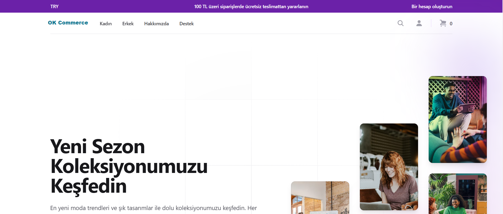
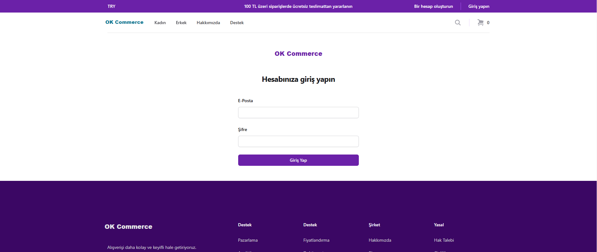
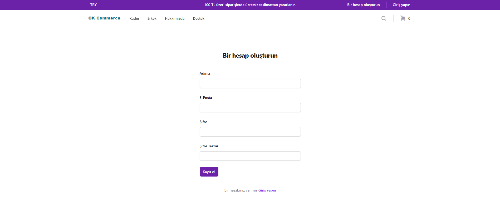
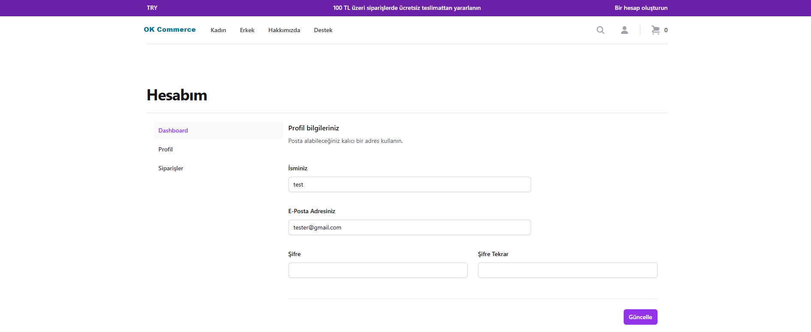
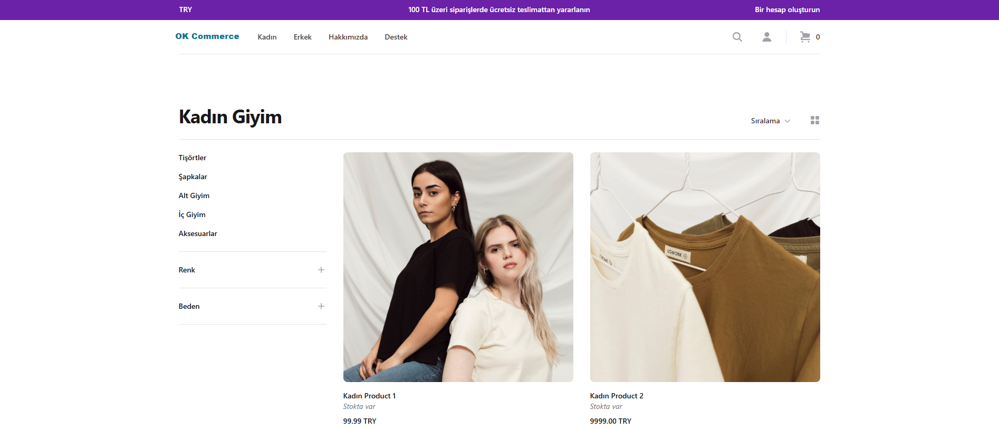
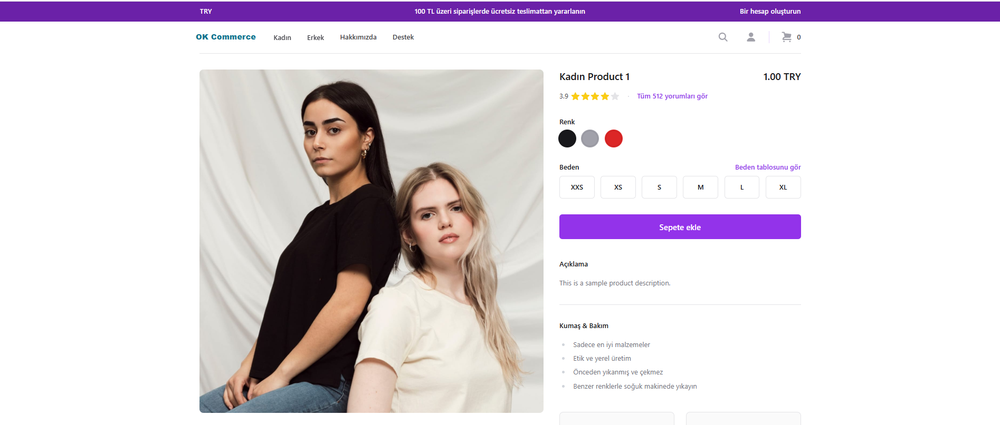
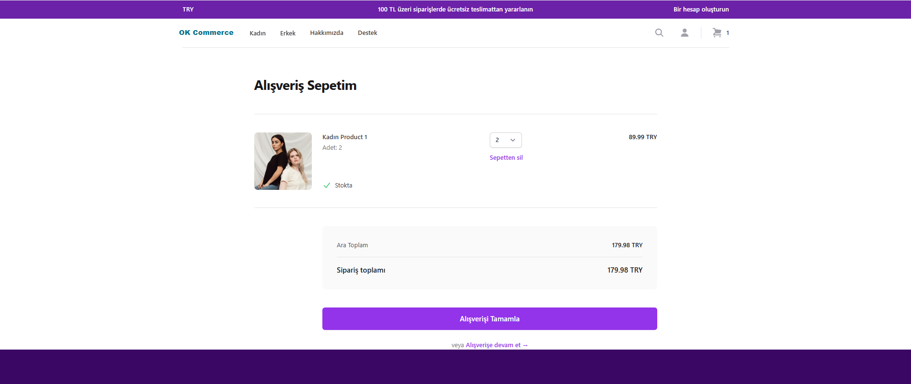
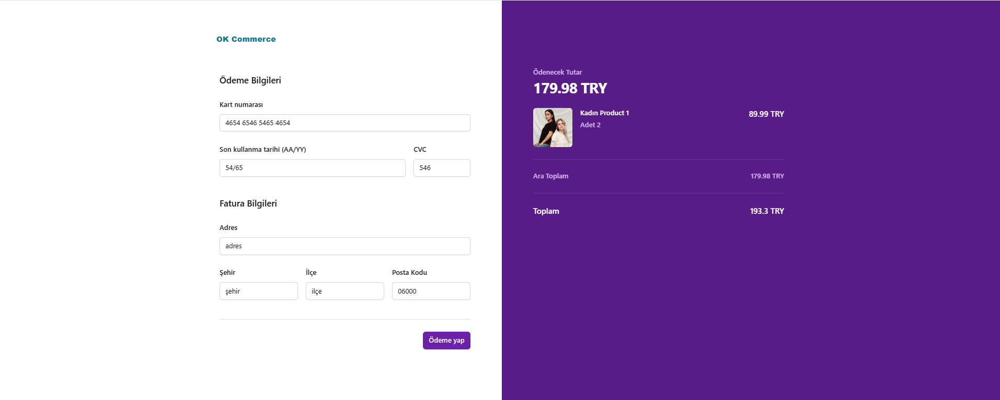
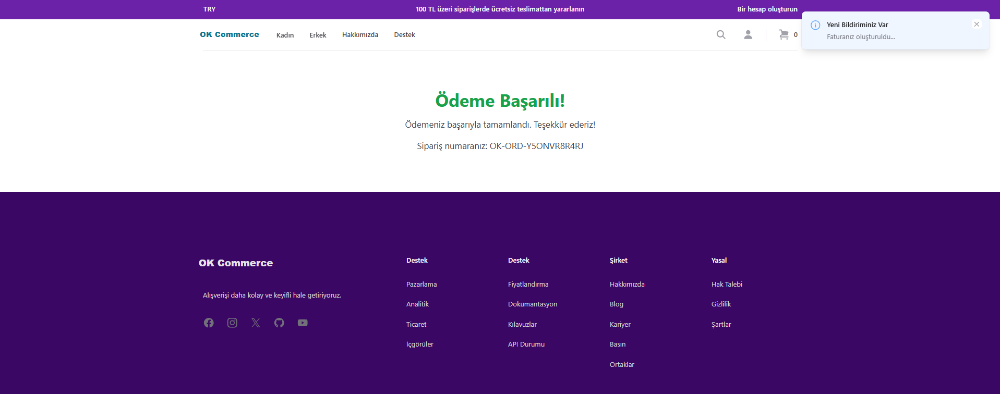
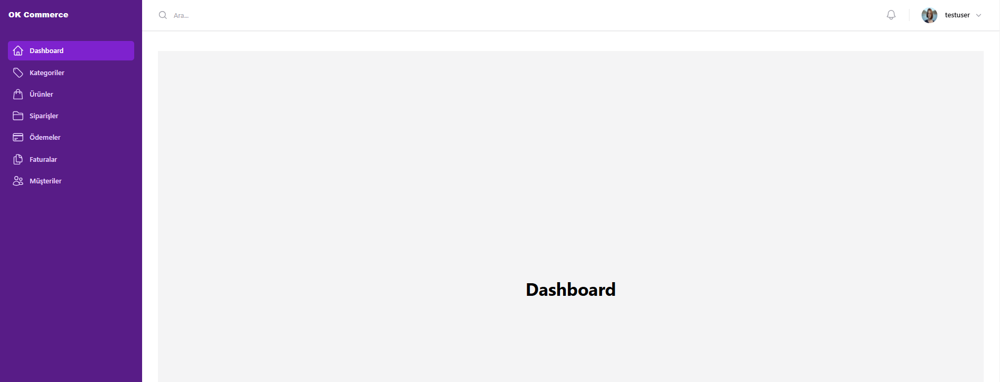

# Docker Commands and Application Setup Guide

This document provides step-by-step instructions to set up and run your application using Docker. The application runs at **http://localhost:3000**.
You can fill out the environment file as shown in the .env.example file and install dependencies with pnpm
You can check the Postman collections for testing in the docs/ folder.

## Running Services with Docker Compose

Use the following commands to cleanly start your services:

1. **Clean Up Services and Data**  
   Remove existing containers, volumes, and unnecessary dependencies:  
   ```bash
   docker compose down --volumes --remove-orphans


2. **Rebuild Containers from Scratch**  

   Rebuild all containers and clear cache:
   ```bash
   docker compose build --no-cache

3. **Start Services**  

   Run all services:
   ```bash
   docker compose up

## Manual Setup
If you prefer not to use Docker Compose, you can manually start it with the following command:
```
docker run \
-p 9200:9200 \
-p 9300:9300 \
-e "discovery.type=single-node" \
-e "xpack.security.enabled=false" \
-m 2g \
docker.elastic.co/elasticsearch/elasticsearch:8.17.0


docker pull wurstmeister/kafka:2.13-2.7.0

docker run -d --name zookeeper -p 2181:2181 wurstmeister/zookeeper:3.4.6
docker run -d --name kafka -p 9092:9092 --link zookeeper:zookeeper -e KAFKA_ZOOKEEPER_CONNECT=zookeeper:2181 -e KAFKA_ADVERTISED_LISTENERS=PLAINTEXT://localhost:9092 wurstmeister/kafka:2.13-2.7.0
```
## Application Access
Once all services are running, you can access your application at:

http://localhost:3000










